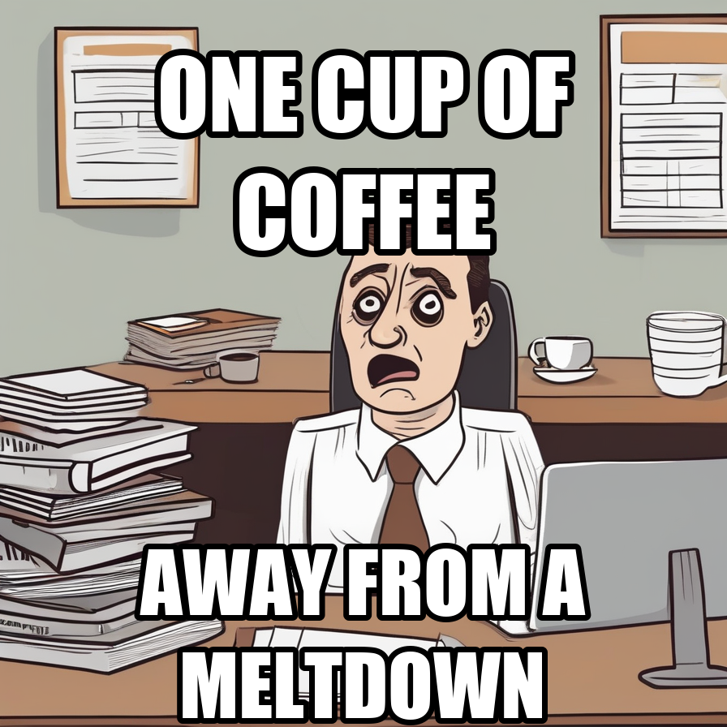
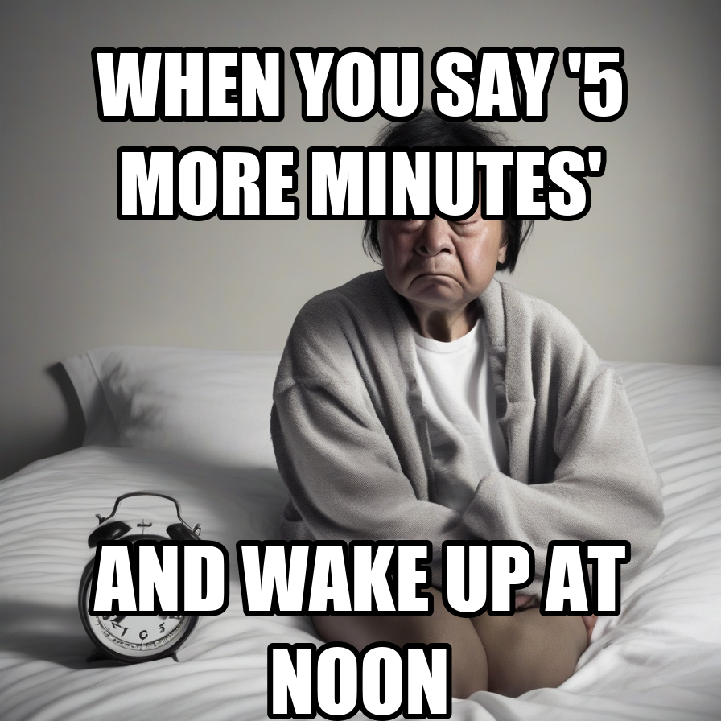
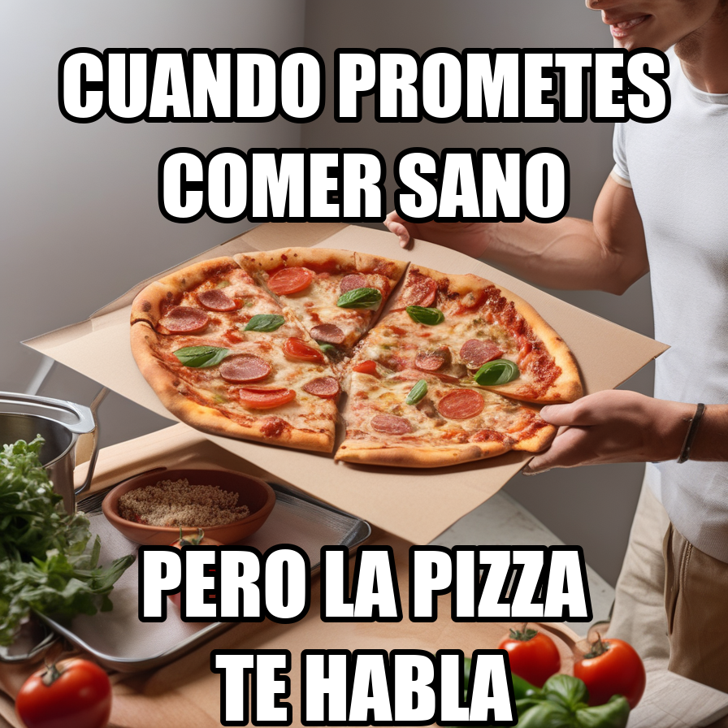

# SarcasmDiffusion

        


**SarcasmDiffusion** es un modelo de generación de imágenes basado en **Stable Diffusion XL**, entrenado con **LoRA** para capturar la esencia visual del sarcasmo y la ironía en los memes.

Utiliza un dataset curado a partir del [*Hateful Memes Dataset* de Facebook AI](https://www.kaggle.com/datasets/parthplc/facebook-hateful-meme-dataset) para generar imágenes limpias y expresivas, listas para que añadas tu propio caption.

[**Notebook de proceso de entrenamiento**](https://github.com/Ricardouchub/SarcasmDiffusion/blob/main/SarcasmDiffusion%20-%20Notebook.ipynb) | [**Modelo en Hugging Face**](https://huggingface.co/Ricardouchub/SarcasmDiffusion)

---

## Arquitectura y Técnicas Utilizadas
| Componente | Descripción |
|-------------|-------------|
| **Modelo base** | [Stable Diffusion XL (Base 1.0)](https://huggingface.co/stabilityai/stable-diffusion-xl-base-1.0) |
| **Fine-tuning** | LoRA sobre el UNet (fp16) |
| **Framework** | Hugging Face Diffusers + PEFT + Accelerate |
| **Dataset** | [Hateful Memes Dataset - 10k](https://www.kaggle.com/datasets/parthplc/facebook-hateful-meme-dataset) |
| **App** | Streamlit UI para inferencia con overlay estilo meme |
| **Preprocesamiento** | NLP con [GoEmotions](https://huggingface.co/joeddav/distilbert-base-uncased-go-emotions-student) + [RoBERTa-Irony](https://huggingface.co/cardiffnlp/twitter-roberta-base-irony) para etiquetado semántico |
| **Formato final** | Modelo fusionado (`sdxl_fused_full`) + LoRA weights |

---

## Hiperparámetros del entrenamiento

| Parámetro | Valor |
|------------|-------|
| Resolución | 1024 px |
| Batch Size | 1 (Grad Accum = 4) |
| Learning Rate | 1e-4 |
| Max Steps | 9,000 |
| LoRA r / α / dropout | 8 / 16 / 0.05 |
| Optimizer | AdamW8bit |
| Scheduler | Cosine + Warmup |

> Entrenamiento realizado con *fp16 mixed precision* en CUDA 12.4 (PyTorch 2.6).

---

## Flujo de trabajo

1. **Fase A — Preprocesamiento**  
   Limpieza del dataset, enriquecimiento con emociones e ironía, y balanceo de tonos.

2. **Fase B — Generación de prompts**  
   Creación automática de descripciones de entrenamiento (`humor`, `irony`, `neutral`).

3. **Fase C — Entrenamiento SDXL con LoRA**  
   Fine-tuning del UNet del modelo con parámetros congelados para preservar calidad base.

4. **Fase D — Inferencia & Overlay**  
   Generación con SDXL + superposición de texto estilo meme.

5. **Fase E — Inferencia y UI**  
   Implementación de una app en Streamlit (`app.py`).

---

## Ejemplos de prompts

| Prompt | Caption arriba | Caption abajo |
|--------|----------------|---------------|
| "sarcastic meme about running on too much coffee" | ONE CUP OF COFFEE | AWAY FROM A MELTDOWN |
| "sarcastic meme about saying 'just five more minutes' of sleep and waking up late" | WHEN YOU SAY '5 MORE MINUTES | AND WAKE UP AT NOON |
| "meme sarcástico sobre intentar comer saludable pero viendo pizza" | CUANDO PROMETES COMER SANO | PERO LA PIZZA TE HABLA |

## Generación









## App


---

## Resultado

✅ Entrenamiento de un modelo de difusión capaz de aprender el **estilo visual** de memes sarcásticos.  
✅ Dataset enriquecido y balanceado automáticamente.  
✅ Generación controlada con *negative prompts* (sin texto ni ruido).  
✅ App de inferencia funcional en Streamlit.  
✅ Overlay automático estilo meme con ajuste dinámico del texto.

---

## Estructura del repositorio

```
SarcasmDiffusion/
├── app.py                              # Interfaz Streamlit para inferencia
├── SarcasmDiffusion.ipynb              # Notebook principal del proyecto
├── data/
│   ├── img/                            # Imágenes originales del dataset
│   ├── processed/
│   │   ├── metadata_v3.csv             # Dataset enriquecido y balanceado
│   │   ├── train_lora_prompts.csv      # Prompts generados por tono
│   │   └── infer_samples/              # Resultados de inferencia
├── models/
│   └── lora_only/                      # Pesos LoRA del UNet
└── img/                                # Carpeta de imágenes para readme

```

---

## Licencia
Este proyecto se distribuye bajo licencia **MIT**.  
Dataset original: *Hateful Memes (Facebook AI)* 

---

## Autor

**Ricardo Urdaneta**  
[GitHub](https://github.com/Ricardouchub) | [LinkedIn](https://www.linkedin.com/in/ricardourdanetacastro)
